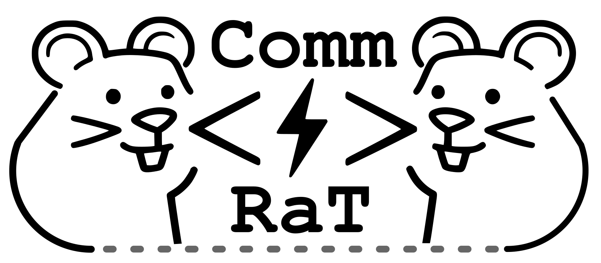

<div align="center" style="background: linear-gradient(135deg, #909060 0%, rgba(72, 72, 48, 1) 50%, #404040 20%, #3a3a3a 100%); padding: 0px 0; margin: -8px -8px 20px -8px;">
  
</div>

# CommRaT - Modern C++ Real-Time Communication Framework

[](https://www.gnu.org/licenses/old-licenses/gpl-2.0.en.html)
[](https://en.cppreference.com/w/cpp/20)

A modern C++20 communication framework that combines **RACK's TiMS IPC** message service with **SeRTial's** zero-allocation serialization, providing compile-time safe, real-time capable messaging with templated message types and a powerful mailbox interface for efficient type dispatch.

**[Full Documentation](docs/README.md)** | **[Getting Started](docs/GETTING_STARTED.md)** | **[Examples](examples/)**

## Features

- **Compile-Time Message IDs**: 0xPSMM format (Prefix, SubPrefix, Message ID) with auto-increment
- **Zero-Allocation Serialization**: Stack-allocated `std::byte` buffers via SeRTial
- **Module2 Framework**: `Module2<Output<T>, Input<T>, Period<D>>` with zero-copy workspace API
- **Multi-Output**: Produce multiple message types with type-specific delivery
- **Multi-Input Synchronization**: `Input<T>` (primary) + `SyncedInput<T>` (secondary) with `Synced<T>` wrapper
- **Auto-Subscription**: `Input<T>` handles subscription protocol automatically
- **3-Mailbox Architecture**: CMD (per-output), WORK (send-only), DATA (per-input) with blocking receives
- **RT-Safe**: No dynamic allocation in hot paths, deterministic behavior
- **SeRTial Integration**: `fixed_vector`, `fixed_string`, compile-time size computation
- **TiMS IPC Backend**: Socket-based real-time messaging from RACK

## Documentation

- **[Getting Started Guide](docs/GETTING_STARTED.md)** - Build your first CommRaT application
- **[User Guide](docs/USER_GUIDE.md)** - Comprehensive framework documentation
- **[API Reference](docs/API_REFERENCE.md)** - Complete API documentation
- **[Architecture & Concepts](docs/README.md)** - Design decisions and current status
- **[Doxygen API Docs](https://mattih11.github.io/CommRaT/)** - Generated API documentation
- **[Examples](examples/)** - Working examples demonstrating all features

## Quick Start

### Installation

**Prerequisites:**
- **SeRTial**: Install from [SeRTial repository](https://github.com/mattih11/SeRTial)
- **RACK**: Install from [RACK repository](https://github.com/smolorz/RACK) (provides TiMS messaging system)

```bash
# Clone the repository
git clone https://github.com/mattih11/CommRaT.git
cd CommRaT

# Build and install
mkdir -p build && cd build
cmake ..
make -j$(nproc)
sudo make install
```

### Your First CommRaT Application

**Step 1: Define Messages**
```cpp
#include <commrat/commrat.hpp>

struct TemperatureData {
    float temperature_celsius;
};

struct StatusData {
    int status_code;
    float average_temp;
};

// Define your application with message types
using MyApp = commrat::CommRaT<
    commrat::Message::Data<TemperatureData>,
    commrat::Message::Data<StatusData>
>;
```

**Step 2: Create Modules**
```cpp
// Producer: publishes temperature every 500ms
class SensorModule : public MyApp::Module2<
    commrat::Output<TemperatureData>,
    commrat::Period<commrat::Milliseconds(500)>
> {
protected:
    void process(TemperatureData& output) override {
        output = {.temperature_celsius = read_sensor()};
    }
};

// Consumer: processes incoming temperature data
class MonitorModule : public MyApp::Module2<
    commrat::Output<StatusData>,
    commrat::Input<TemperatureData>
> {
protected:
    void process(const TemperatureData& input, StatusData& output) override {
        std::cout << "Temperature: " << input.temperature_celsius << " C\n";
        output = calculate_status(input);
    }
};

// Multi-Output Producer: generates multiple message types simultaneously
class SensorFusion : public MyApp::Module2<
    commrat::Output<RawData>,
    commrat::Output<FilteredData>,
    commrat::Output<Diagnostics>,
    commrat::Period<commrat::Milliseconds(100)>
> {
protected:
    void process(RawData& raw, FilteredData& filtered, Diagnostics& diag) override {
        raw = read_sensors();
        filtered = apply_filter(raw);
        diag = compute_diagnostics(raw, filtered);
    }
};
```

**Step 3: Run**
```cpp
int main() {
    // Config for timer-driven producer
    commrat::SimpleOutputConfig sensor_config{
        .name = "Sensor",
        .system_id = 10,
        .instance_id = 1
    };
    
    // Config for input-driven consumer (source = sensor)
    commrat::SimpleOutputConfig monitor_config{
        .name = "Monitor",
        .system_id = 20,
        .instance_id = 1,
        .source_system_id = 10,
        .source_instance_id = 1
    };
    
    SensorModule sensor(sensor_config);
    MonitorModule monitor(monitor_config);
    
    sensor.start();
    monitor.start();  // Auto-subscribes to sensor
    
    commrat::Time::sleep(commrat::Seconds(10));
    
    monitor.stop();
    sensor.stop();
}
```

**See [Getting Started Guide](docs/GETTING_STARTED.md) for complete tutorial.**

## Running Examples

All examples demonstrate the framework's features with clean, professional output:

```bash
cd build

# Producer→Consumer with auto-subscription
./example_continuous_input

# Minimal boilerplate example
./example_clean_interface

# Type-safe command handling
./example_commands

# Maximum throughput demo (~200K-400K iter/sec)
./example_loop_mode

# Multi-output with 2 types
./example_multi_output_runtime

# Advanced sensor fusion with 3 outputs
./example_sensor_fusion
```

**See [examples/](examples/) directory for source code.**

## Building Documentation

Generate API documentation locally:

```bash
cd build
make docs
```

Documentation will be generated in `docs/api/html/index.html`. Open in your browser or view online at [mattih11.github.io/CommRaT](https://mattih11.github.io/CommRaT/).

## Architecture Highlights

- **3-Mailbox System**: CMD (per-output, blocking receive), WORK (per-module, send-only), DATA (per-input)
- **Blocking Receives**: 0% CPU when idle, immediate response when active
- **Compile-Time IDs**: Message IDs calculated at compile time with collision detection
- **Auto-Subscription**: `Input<T>` automatically handles subscription protocol
- **Type-Safe Dispatch**: Visitor pattern for runtime dispatch without virtual functions
- **Real-Time Safe**: No dynamic allocation in hot paths, deterministic behavior

**[Read Full Architecture Documentation →](docs/README.md)**

## License

See LICENSE file for details.

## References

- **[RACK Project](https://github.com/smolorz/RACK)** - Robotics Application Construction Kit (provides TiMS messaging system)
- **[SeRTial Library](https://github.com/mattih11/SeRTial)** - Reflective C++ serialization
