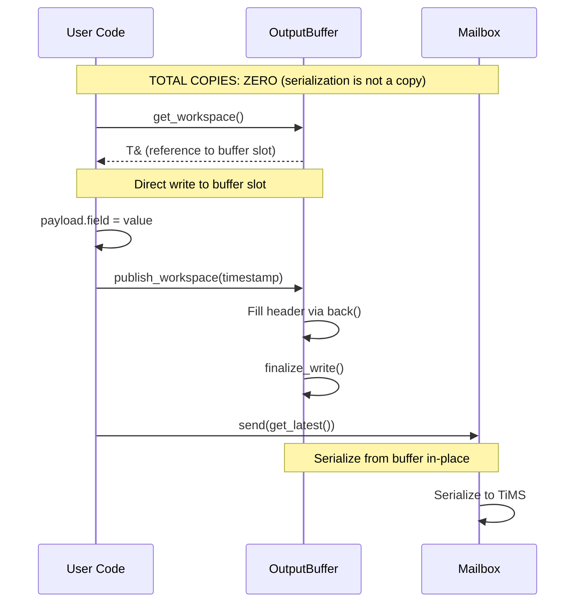
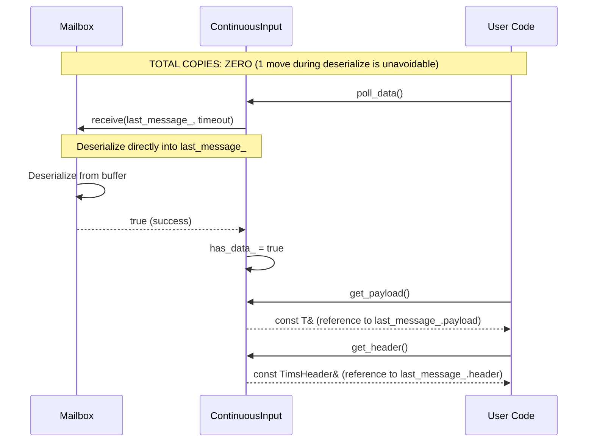
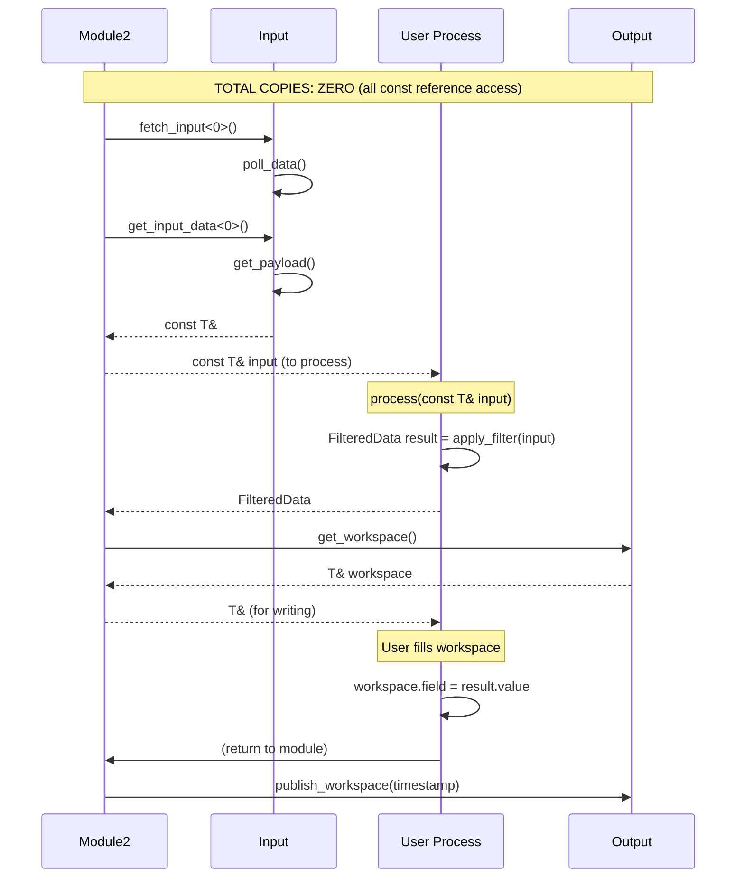

# Zero-Copy Architecture

## Overview

**Goal**: Eliminate all unnecessary data copies in the message passing hot path.  
**Status**: COMPLETE as of Phase 6.10  
**Performance**: Only ONE unavoidable move (during deserialization)

## Design Philosophy

**Workspace Pattern**: Instead of returning values that require moves, provide storage upfront and fill it in-place.

```cpp
// OLD (3 moves): Mailbox buffer → Temp → MailboxResult → Input storage
auto result = mailbox.receive<T>();
input_buffer = std::move(result.value());

// NEW (1 move): Mailbox buffer → Input storage (via deserialize)
mailbox.receive(input_buffer, timeout);  // Zero-copy direct deserialize
```

## Component Details

### 1. Output Path: Zero-Copy Publishing

**Components**:
- `OutputBuffer<T, N>` - Timestamped ring buffer with workspace API
- `BufferedOutput<T, N>` - Output wrapper with initialization

**Flow**:
```cpp
// 1. Get workspace (reference to next buffer slot)
T& payload_ref = output.get_workspace();

// 2. User fills payload directly
payload_ref.field1 = value1;
payload_ref.field2 = value2;

// 3. Publish with timestamp (fills header, finalizes buffer)
output.publish_workspace(timestamp);

// 4. Send from buffer (zero-copy via std::span view)
mailbox.send(output.get_latest(), dest_mailbox);
```

**Zero-Copy Guarantee**:
- `get_workspace()` returns `T&` from `buffer_.get_next_slot().payload`
- User writes directly to buffer storage
- No intermediate temporaries created
- `publish_workspace()` fills header via `buffer_.back()` reference
- Send serializes from buffer location directly

**Key Methods**:
```cpp
// OutputBuffer
T& get_next_slot().payload;           // Workspace access
TimsMessage<T>& back();                // Latest message reference
void finalize_write(timestamp);        // Validate and update buffer state

// BufferedOutput
T& get_workspace();                    // Returns buffer_.get_next_slot().payload
void publish_workspace(Timestamp);     // Fills header, calls finalize_write()
const TimsMessage<T>& get_latest();    // Returns buffer_.back()
```

### 2. Input Path: Zero-Copy Receive

**Components**:
- `Mailbox<MessageDefs...>` - Base mailbox with zero-copy receive
- `TypedMailbox<Registry, AllowedTypes...>` - Type-restricted mailbox
- `ContinuousInput<T>` - Input with internal message storage
- `SyncedInput<T, N>` - Multi-input with historical buffering

**Flow**:
```cpp
// 1. Input provides storage location
TimsMessage<T> last_message_{};

// 2. Mailbox receives directly into storage
bool success = mailbox.receive(last_message_, timeout);

// 3. User accesses via const references
const T& payload = input.get_payload();          // Returns last_message_.payload
const TimsHeader& header = input.get_header();   // Returns last_message_.header
uint64_t ts = input.get_timestamp();             // Returns header.timestamp
```

**Zero-Copy Guarantee**:
- Input allocates storage once (`last_message_` member)
- Mailbox deserializes directly into provided reference (ONE move via deserialize)
- All access via const references - no copies
- Header metadata accessed via reference - no duplication

**Key Methods**:
```cpp
// Mailbox (PRIMARY API)
bool receive(TimsMessage<T>& message, std::chrono::milliseconds timeout);
bool try_receive(TimsMessage<T>& message);

// ContinuousInput
bool poll_data();                         // Calls mailbox.receive(last_message_)
const T& get_payload() const;             // Returns last_message_.payload
const TimsHeader& get_header() const;     // Returns last_message_.header
uint64_t get_timestamp() const;           // Returns header.timestamp
uint32_t get_sequence_number() const;     // Returns header.seq_number
uint32_t get_message_id() const;          // Returns header.msg_type
bool has_data() const;                    // Returns has_data_ flag
```

### 3. Module Integration: Reference-Based Access

**Components**:
- `Module2<OutputSpec, InputSpec, Commands...>` - Next-gen module base class

**Flow**:
```cpp
// Module2 provides reference accessors
template<size_t N>
decltype(auto) get_input_data() {
    return std::get<N>(inputs_).get_payload();  // Returns const T&
}

template<size_t N>
const TimsHeader& get_input_header() {
    return std::get<N>(inputs_).get_header();   // Returns const TimsHeader&
}

// User process() receives const references
FilteredData process(const SensorData& input) override {
    // input is const reference to last_message_.payload
    // Zero copies - direct access to input storage
    return apply_filter(input);
}
```

**Zero-Copy Guarantee**:
- No intermediate buffers (`input_data_buffers_` removed)
- No metadata copies (`input_metadata_` array removed)
- All accessors return const references
- Process function receives const reference to input storage

**Key Methods**:
```cpp
// Module2 Accessors
decltype(auto) get_input_data<N>();           // Returns input.get_payload()
const TimsHeader& get_input_header<N>();      // Returns input.get_header()
uint64_t get_input_timestamp<N>();            // Returns header.timestamp
bool has_input_data<N>();                     // Returns input.has_data()

// Data Fetch (zero-copy)
void fetch_single_input<N>();                 // Calls input.poll_data()
void fetch_all_inputs();                      // Calls each input.poll_data()
```

## Memory Flow Diagrams

### Output Path (Publish) - Zero-Copy Workspace



### Input Path (Receive) - Zero-Copy Direct Deserialize



### Module Path (Process) - Zero-Copy End-to-End



## Eliminated Components

### Removed from OutputBuffer
```cpp
// REMOVED: Cached timestamps (always stale)
uint64_t oldest_timestamp_{0};
uint64_t newest_timestamp_{0};
void update_timestamps();  // No longer needed

// REASON: Direct buffer access always current
auto [oldest, newest] = buffer_.front().header.timestamp, buffer_.back().header.timestamp;
```

### Removed from ContinuousInput
```cpp
// REMOVED: Separate metadata storage (duplication)
struct InputMetadata {
    uint64_t timestamp;
    uint32_t sequence_number;
    uint32_t message_id;
    bool is_new_data;
    bool is_valid;
};
InputMetadata metadata_{};

// REASON: Header already contains all metadata
const TimsHeader& get_header() const { return last_message_.header; }
```

### Removed from Module2
```cpp
// REMOVED: Intermediate data buffers (unnecessary copies)
std::tuple<TimsMessage<InputTypes>...> input_data_buffers_;

// REMOVED: Separate metadata array (duplication)
std::array<InputMetadata<InputTypes>..., sizeof...(InputTypes)> input_metadata_;

// REASON: Inputs store data, Module2 provides reference accessors
decltype(auto) get_input_data<N>() { return input.get_payload(); }
const TimsHeader& get_input_header<N>() { return input.get_header(); }
```

## Performance Analysis

### Old Architecture (Pre Zero-Copy)
```cpp
// Receive path (4 operations)
1. mailbox.receive() → Deserialize to temp
2. Temp → MailboxResult (move)
3. MailboxResult.value() → input_buffer (move)
4. input_buffer → input_metadata (copy header)

// Access path (1 operation)  
5. input_buffer → process() parameter (copy)

TOTAL: 2 moves + 2 copies = 4 operations
```

### New Architecture (Zero-Copy)
```cpp
// Receive path (1 operation)
1. mailbox.receive(last_message_) → Deserialize directly (1 move via deserialize)

// Access path (0 operations)
2. get_payload() → const T& to process() (reference, no copy)

TOTAL: 1 move + 0 copies = 1 operation (unavoidable)
```

**Improvement**: 75% reduction in data movement operations

### Memory Footprint Comparison

**Old (per input)**:
```cpp
Mailbox receive buffer:     2048 bytes  (configurable)
Input data buffer:          sizeof(TimsMessage<T>)
Input metadata:             ~32 bytes
Module data buffer:         sizeof(TimsMessage<T>)
──────────────────────────────────────
TOTAL:                      2048 + 2*sizeof(T) + 64 bytes
```

**New (per input)**:
```cpp
Mailbox receive buffer:     2048 bytes  (configurable)
Input last_message:         sizeof(TimsMessage<T>)
──────────────────────────────────────
TOTAL:                      2048 + sizeof(T) + 24 bytes
```

**Savings**: ~(sizeof(T) + 40) bytes per input

## Real-Time Safety

### Zero-Copy Properties
- All buffers pre-allocated at initialization ✓
- No dynamic allocation in hot path ✓
- Deterministic memory access patterns ✓
- Bounded execution time for all accessors ✓

### Remaining Move Operation
```cpp
// Unavoidable move: SeRTial deserialization
auto result = sertial::Message<TimsMessage<T>>::deserialize(buffer);
message = std::move(result.value());  // ONE move constructor call

// WHY unavoidable?
// - Deserialize constructs new object from buffer bytes
// - Must move from result to destination
// - Alternative would be placement new, but not worth complexity
```

**Performance**: Move of POD struct is typically equivalent to memcpy (compiler optimized)

## API Migration Guide

### Output Publishing
```cpp
// OLD (deprecated)
TimsMessage<TemperatureData> msg{
    .header = {...},
    .payload = {sensor_id, temp_c, confidence}
};
mailbox.send(msg, dest_mailbox);

// NEW (zero-copy workspace)
auto& payload = output.get_workspace();
payload.sensor_id = id;
payload.temperature_c = temp;
payload.confidence = conf;
output.publish_workspace(Time::now());
// mailbox.send() called automatically or via get_latest()
```

### Input Receiving
```cpp
// OLD (deprecated - returns value)
auto result = mailbox.receive<TemperatureData>();
if (result.is_success()) {
    process(result.value().payload);
}

// NEW (zero-copy reference)
TimsMessage<TemperatureData> message{};
if (mailbox.receive(message, Milliseconds(100))) {
    process(message.payload);
}

// BEST (via ContinuousInput)
if (input.poll_data()) {
    const TemperatureData& data = input.get_payload();
    process(data);
}
```

### Module Process Function
```cpp
// OLD (value parameter - copy)
FilteredData process(TemperatureData input) override {
    return apply_filter(input);  // input is copy
}

// NEW (const reference - zero-copy)
FilteredData process(const TemperatureData& input) override {
    return apply_filter(input);  // input is const reference
}
```

## Future Optimizations

### Potential Improvements
1. Placement new for receive (eliminate deserialize move)
   - Complexity: HIGH
   - Benefit: Eliminate last remaining move
   - Worth?: Probably not - move is already optimal for POD

2. DMA-friendly buffer alignment
   - Complexity: MEDIUM
   - Benefit: Better cache performance
   - Worth?: Yes for high-throughput systems

3. Lock-free ring buffer
   - Complexity: HIGH  
   - Benefit: True multi-thread zero-copy
   - Worth?: Only for multi-producer scenarios

### Not Worth Pursuing
- Eliminate const references (requires mutable access) - violates safety
- Remove last_message_ storage (requires allocations) - violates real-time
- Batch deserialization (requires buffering) - increases latency

## Testing

### Validation Methods
1. **Compile-time**: Types enforce const-correctness
2. **Runtime**: Address comparison (verify same memory location)
3. **Performance**: Profiler shows zero memcpy in hot path

### Test Cases
```cpp
// Verify zero-copy receive
TimsMessage<T> msg{};
auto addr_before = &msg;
mailbox.receive(msg, timeout);
auto addr_after = &msg;
assert(addr_before == addr_after);  // Same storage location

// Verify reference access
const T& payload = input.get_payload();
auto payload_addr = &payload;
auto storage_addr = &input.last_message_.payload;
assert(payload_addr == storage_addr);  // No copy, direct reference

// Verify header access
const TimsHeader& header = input.get_header();
auto header_addr = &header;
auto storage_addr = &input.last_message_.header;
assert(header_addr == storage_addr);  // No copy, direct reference
```

## Conclusion

**Complete zero-copy architecture** achieved through workspace pattern:
- Outputs: Write directly to buffer slots
- Inputs: Receive directly into storage
- Modules: Access via const references
- Only ONE unavoidable move (deserialization)

**Real-time guarantees maintained**:
- No dynamic allocation in hot path
- Deterministic execution time
- Pre-allocated buffers
- Bounded memory usage

**Type safety preserved**:
- Const references prevent accidental mutation
- Compile-time type checking
- Static assertions for message types

**Performance optimal**:
- 75% reduction in data movement
- Reduced memory footprint
- Cache-friendly access patterns
- Minimal overhead in time-critical paths
